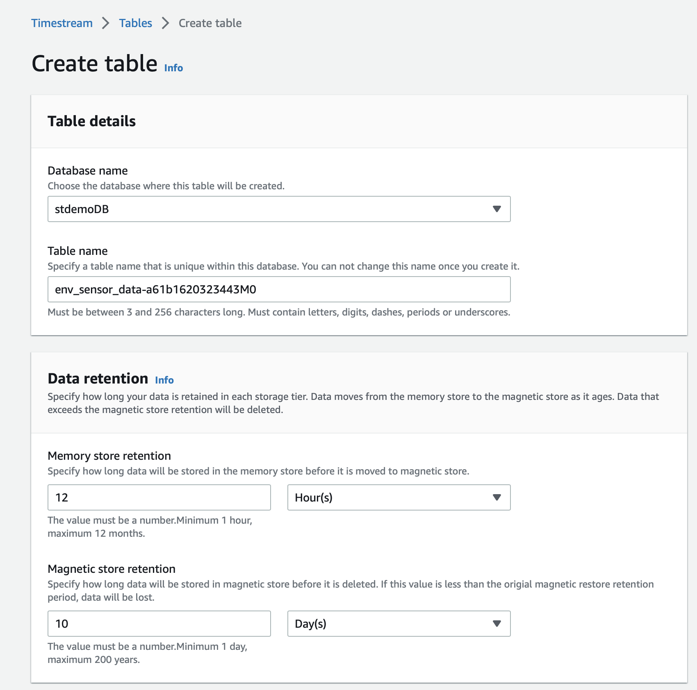
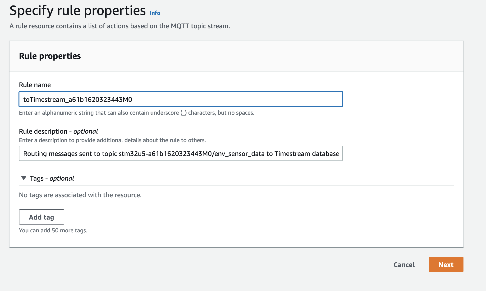
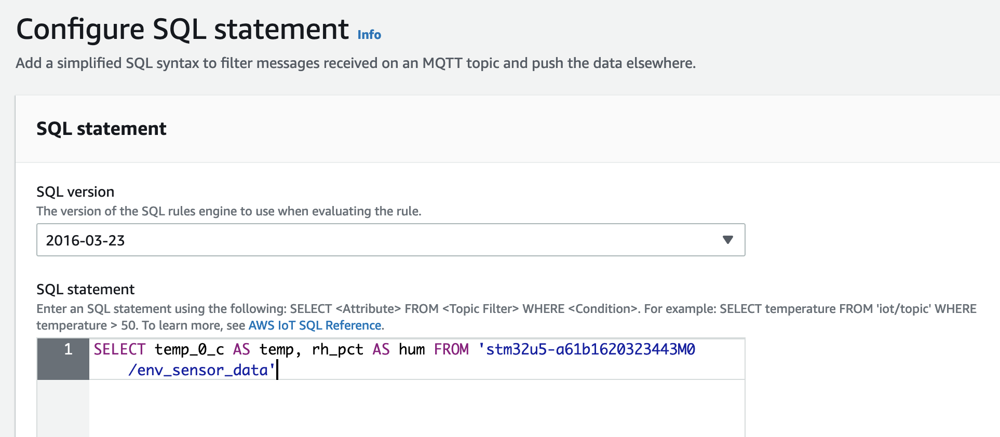
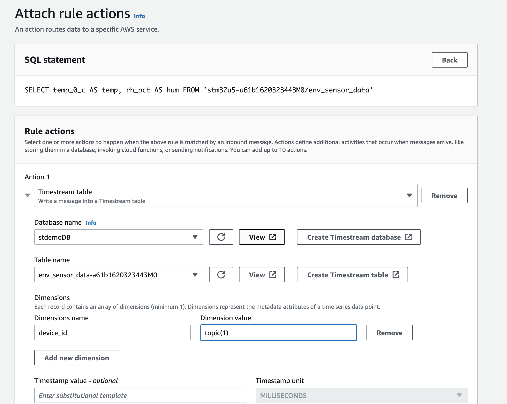

# ST Technology Tour 2022
### Timestream configuration and data ingestion from AWS IoT Core

In this tutorial we will:

- create an Amazon Timestream database (which is AWS specialized serverless database for time-series data)
- create a table to store readings from STM32U5 environmental sensors
- create a rule in AWS IoT to send the data from MQTT topic to Amazon Timestream
- create managed Grafana workspace
- visualize the temperature and humidity data in Amazon Grafana

AWS IoT rules give your devices an ability to send the data to a variety of AWS services, such as S3, DynamoDB, Lambda, OpenSearch, Timestream, etc. Rules also can perform data filtering and transformation. To learm more refer to [official documentation](https://docs.aws.amazon.com/iot/latest/developerguide/iot-rules.html).

### MQTT topics structure and payload format

In the STM32U5 AWS QuickConnect workshop, you should already know the deviceID. If not open the serial console to STM32U5 and reset the board pressing the black RST button. Look for the string similar to:

```
<INF>      790 [MQTTAgent ] Client Certificate: CN=stm32u5-a61b1620323443M0, SN:0x5A7C3C321EDBC7F9
```
The CN value is the first level MQTT topic that your device is publishing on. Environmental sensors are published to:

```
stm32u5-XXXXXXXXXXXXXXXX/env_sensor_data
```
In my case it is *stm32u5-a61b1620323443M0/env_sensor_data*

The payload for environmental sensors is a structured JSON:

```json
{
  "temp_0_c": 36.11742,
  "rh_pct": 30.602741,
  "temp_1_c": 36.150002,
  "baro_mbar": 1012.073242
}
```
It is important as it allows rule engine to do transformation and enrichment of data on the fly.

Now that we know our topic structure and payload, lets publish that data to Amazon Timestream database.

### Amazon Timestream

1. Log in to AWS Console and navigate to: **Services $\to$ Database $\to$ Amazon Timestream**
  - In our case the database *stdemoDB* is already created, but if you will be doing it in your own account create a database:
2. Create a table with following name *env_sensor_data-XXXXXXXXXXXXXXXX*, where the *XXXXXXXXXXXXXXXX* is the value assigned to your board (*a61b1620323443M0* in my case). Leave the *memory store retention* value to *12 hours*, but change the magnetic store retention to *10 **days***
<!--  -->


### AWS IoT Core Rules

1. In the AWS Console navigate to **Services $\to$ Internet of Things $\to$ IoT Core**. On that screen from the left-hand panel chose **Message Routing $\to$ Rules**
2. Create the rule with the name *toTimestream_XXXXXXXXXXXXXXXX* and description *Routing messages sent to topic stm32u5-XXXXXXXXXXXXXXXX/env_sensor_data to Timestream database stdemoDB and table env_sensor_data-XXXXXXXXXXXXXXXX*. Click **Next**


3. Enter the SQL statement to get temperature and humidity reading from environmental sensors payload and click **Next**
```sql
SELECT temp_0_c AS temp, rh_pct AS hum FROM 'stm32u5-XXXXXXXXXXXXXXXX/env_sensor_data'
```


4. Attache the action. Choose **Timestream table** as the Action, select *stdemoDB* database and *env_sensor_data-XXXXXXXXXXXXXXXX* as a table. Configure the dimension with the dimension name *device_id* and dimension value *${topic(1)}*



### Amazon Grafana

1. In AWS Console navigate to **Services $\to$ Management&Governance $\to$ Amazon Grafana**
2. Click *Create Workspace*
3. Enter your identifier (XXXXXXXXXXXXXXXX) as the *Workspace name* and "XXXXXXXXXXXXXXXX Dashboard for visualizing environmental sersors' data" as *Workspace description*. Click **Next**
4. For Authentication Access, chose *AWS IAM Identity Center*, and for Permission Type *Service managed*. Click **Next**
5. For IAM permission access settings chose *Current account* and select *Amazon Timestream* as a data source. Don't select anything for Notification channels. Click **Next**
6. Review and click **Create Workspace**
7. In Authentication tab select *Configure Users and Groups* from AWS IAM Identity Center section. Select *Grafana User*
8. Select *Grafana User* and in the *Actions* menu click **Make Admin**
9. Click on *Amazon Grafana > Workspaces > XXXXXXXXXXXXXXXX* to return to your Grafana workspace.
10. Open the Grafana workspace by clicking on *Grafana Workspace URL*. Sign with the *grafana* user and the password that will be provided by your instructor.
11. Click on **AWS $\to$ Data Sources**. Select *Timestream*. Select *N.Virginia (us-east-1)* as AWS Region. Click **Add data source**
12. In the Settings select *stdemoDB* as a database, your Timestream table (e.g. *env_sensor_data-XXXXXXXXXXXXXXXX*) and the *temp* as a measure
13. Create a new dashboard by selecting **+ $\to$ Dashboard**
14. Add new panel
15. In the Query window, enter:
```sql
SELECT * FROM $__database.$__table WHERE measure_name='$__measure'
```
16. For the time range chose *Last 15 minutes*
17. Observe the time series chart of the temperature fluctuations.
18. Save the dashboard as Temperature in Burlington
